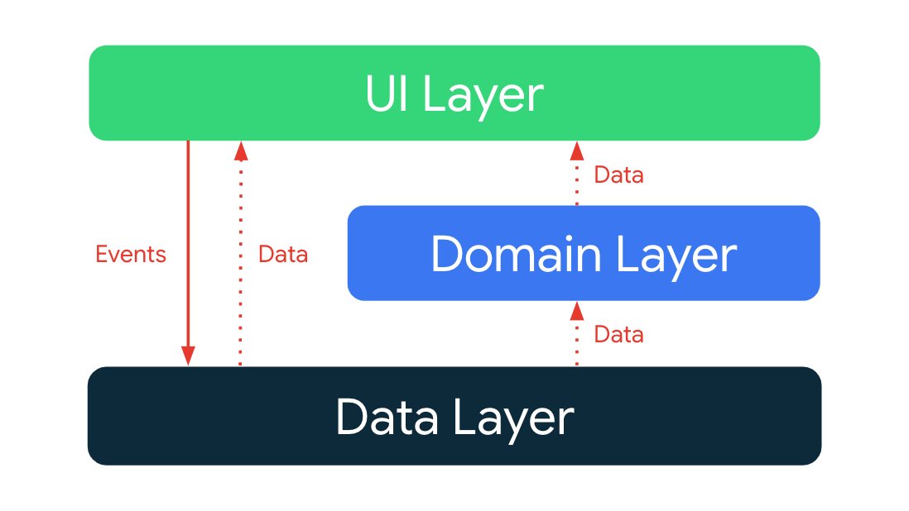

Blooure App
==================

**Blooure App** is a fully functional multiplatform app built entirely with Kotlin and Jetpack Compose. This
Follows design and development best practices.

## Setup
- As it is a project made in KMM, if you want to generate the iOS version, you will need a MacOS.

## Tech stack & Open-source libraries
- Kotlin based, Jetpack Compose, MVI, Room, Coroutines flow + StateFlow for asynchronous.

- **Jetpack**
  - Compose: A modern toolkit for creating a native UI
  - ViewModel: Manages UI-related data holder and lifecycle aware. Allows data to survive configuration changes such as screen rotations.
  - Koin: for dependency injection.
  - Room: Local Database

- **Architecture**
  - MVI Architecture (Model - View - Intent)
  - Module Pattern
  - Repository Pattern

## Improvements
- Add button to add new user on Add Blood Pressures Screen
- Filter on Home Screen
- Create more unit tests
- Implement DarkTheme

## Architecture overview

The app architecture has three layers: a [data](https://developer.android.com/jetpack/guide/data-layer), [domain](https://developer.android.com/topic/architecture/domain-layer) and [UI](https://developer.android.com/jetpack/guide/ui-layer)

